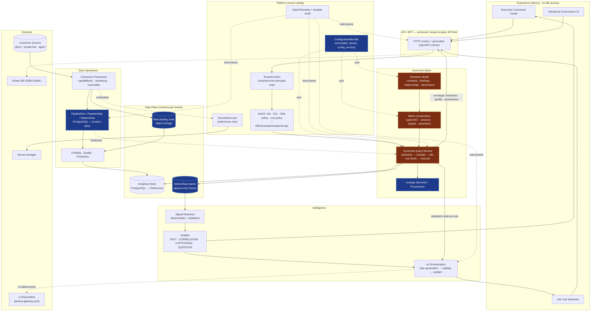

# 17 — Phase 0 Architecture Validation Review

Date: 2026-08-07
Reviewer role: Principal Platform Architect
Scope: `CLAUDE.md`, `AGENTS.md`, `docs/01`–`docs/16`
Output: ADR-001 … ADR-015 (`docs/adr/`), this report, and
[`18_FIRST_VERTICAL_SLICE.md`](18_FIRST_VERTICAL_SLICE.md)

> This review deliberately argues *against* the proposed architecture wherever a case can
> be made. Where the documentation is right, it says so briefly and moves on. Where it is
> wrong, it says why and what to do instead.

---

## Executive Summary

The documented architecture is **directionally correct and unusually disciplined for its
stage**. The governed spine (semantic layer → metric engine → governed query service), the
prohibition on LLM database access, the evidence-first insight model, and the refusal to
recreate the workbook are the right load-bearing commitments. Most products in this
category get at least two of those wrong.

**Phase 0's verdict: the architecture is approved to proceed, with eleven required
changes.** Six of them are corrections to genuine defects; five are capabilities that are
missing and cannot be added cheaply later.

The single most important finding concerns the central requirement:

> A new company must be onboarded primarily through **configuration**, not software
> development. Company A's `Invoice.TotalAmount` and Company B's
> `billing.transactions.net_value` must both map to `Revenue.Amount`.

**As documented, the platform does not achieve this.** It achieves *naming* independence
and would fail at *semantic* independence. The `FieldMapping` model
(`SourceField → Transformation → SemanticField`) has no concept of **grain**, no **row
qualification**, no **join model**, no **units/currency**, and no **time anchor**. Both
companies would map cleanly through the documented model, and at least one of them would
get a wrong revenue number that looks entirely plausible. That is the worst possible
failure mode for a trust product.

[ADR-005](adr/ADR-005-semantic-model.md) fixes this by making the **entity binding** —
not the field mapping — the governed unit, with a declared semantic contract that can be
*automatically validated*. With that change, the requirement is genuinely met. Without it,
the platform's central claim is false and the failure will surface at the second customer,
not the first.

The second most important finding is a latent security defect: the documented cache design
keys on tenant only. Combined with the required row-level security, that is an
**intra-tenant data leak** — user A's restricted result served to user B. Fixed in
[ADR-007](adr/ADR-007-governed-query-engine.md) §4.

On technology: **eleven of the twelve proposed choices are confirmed.** One is changed
(background processing), one is decomposed into two distinct product modes (the analytical
vendors), and several are confirmed with conditions attached. No technology was changed
merely because an alternative exists.

---

## Architecture Strengths

These are genuine and should be protected against erosion:

1. **One governed path to every number.** Principle 10 — dashboards and the assistant
   share the semantic/query spine — is the decision that makes the product defensible.
   Most competitors bolt a chat surface onto a separate text-to-SQL path and then cannot
   explain why two numbers disagree.
2. **The LLM is an explainer, not an oracle.** No unrestricted database access, no
   invented numbers, deterministic detection before narrative. This is the correct and
   currently unfashionable choice.
3. **Fact / correlation / hypothesis separation as a hard rule.** Principle 12 is a
   product differentiator, not just hygiene, and it is stated early enough to shape the UI.
4. **The workbook is explicitly a prototype, and its dimensions are explicitly metadata.**
   `02_WORKBOOK_FINDINGS.md` does the hard intellectual work of translating cells into
   metadata rather than porting a spreadsheet. This is the discipline most Excel-to-SaaS
   projects fail at.
5. **Modular monolith with named bounded contexts, no microservices without an ADR.**
   Correct for this stage and this team size.
6. **Provider neutrality for connectors and the LLM as first-class guardrails**, not
   afterthoughts.
7. **Governance as product** — versioning, human approval, audit, lineage-as-a-feature.
   The insight that lineage is an *executive* feature rather than a developer feature is
   the strongest product idea in the documentation set.
8. **Attention surface over chart wall.** `08_UX_EXECUTIVE_EXPERIENCE.md` correctly refuses
   to build a dashboard builder.
9. **The guardrail documents are enforceable and short.** They will actually be read.

---

## Architecture Weaknesses

Ordered by severity.

### W1 — The semantic layer is field-level; real mapping is entity-level *(critical)*

No grain, no natural key, no row-qualifying filter, no join model, no units, no time
anchor. Detailed in ADR-005. This is the finding that determines whether the product's
central claim is true.

Concretely, for the stated example:

| Concern | Company A `Invoice` | Company B `billing.transactions` | Field mapping handles it? |
| --- | --- | --- | --- |
| Grain | one invoice header | one transaction line | **No** |
| Qualification | all rows are revenue | includes refunds, intercompany, test rows | **No** |
| Units | cents, gross of tax, local currency | dollars, net, pre-converted USD | **No** |
| Time anchor | `invoice_date` | `posted_at` vs `recognized_at` | **No** |
| Slicing by region | region on customer table | region on account table, 2 hops | **No** |

Five out of five of the things that determine whether the number is *correct* are outside
the documented model.

### W2 — Cache keys omit the authorization scope *(critical, security)*

`07` specifies tenant-prefixed cache keys. With row-level security and semantic-field
restrictions also specified, two users in one tenant with different scopes will collide on
the same key. Fixed in ADR-007 §4 / ADR-003 §4.

### W3 — The metric `expression` is undefined and implicitly a string *(high)*

A free-text expression cannot be diffed, validated, lineage-traced, or compiled portably,
and it is the trapdoor through which ad-hoc SQL re-enters. Fixed in ADR-006 (typed AST).

### W4 — No decision on materialize-vs-federate *(high)*

`03` lists both an "Ingestion / ELT" layer and an "Analytical Store" queried by the metric
engine, and never states whether the platform copies data or pushes down to sources. This
determines data residency, freshness semantics, cost, and whether a customer's DBA will
approve the pilot. Decided in ADR-007 §7 / ADR-008: **materialize**, with federation as a
future mode.

### W5 — Per-object versioning cannot express a coherent system state *(high)*

Rolling back a mapping without the metric that depends on it produces an inconsistent
configuration, and there is no identifier that answers "what configuration produced this
number?" Fixed in ADR-013 (`ConfigurationBundle`).

### W6 — Lineage is design-time only, and is modelled as a stored entity *(high)*

`09`'s `MetricLineage` entity will drift from reality. And nothing in the documentation
answers "why is this number different from last Tuesday's?" Fixed in ADR-012 (derived
lineage + run-time provenance + restatement).

### W7 — The connector contract will not survive real sources *(high)*

Synchronous, non-streaming, non-resumable, and with no capability declaration — so the
ingestion planner would have to branch on connector type, violating principle 4. Fixed in
ADR-004.

### W8 — No egress control and no customer-connectivity model *(high, security + GTM)*

A tenant-configured REST or JDBC connector is a server-side request forgery primitive
aimed at our own network and at cloud metadata endpoints. Separately, most enterprise
databases are not internet-reachable, so "Add a PostgreSQL source" has no answer for the
majority of the target market. Both addressed in ADR-004.

### W9 — `total` is modelled as a peer dimension value *(medium, but symptomatic)*

`02_WORKBOOK_FINDINGS.md` lists `total` alongside `people`/`process`/`technology`/
`enterprise`. `Total` is the aggregate *over* those, not a sibling; treating it as a value
double-counts on any unfiltered aggregation. This is workbook thinking surviving into the
metadata model — the exact failure `02` exists to prevent. Corrected in ADR-005 §5.

### W10 — Prompt injection through tenant data is unaddressed *(medium-high, security)*

Discovered field names, table comments, glossary terms, and sampled values all flow into
prompts, most aggressively in the AI mapping assistant whose entire job is reading
untrusted source metadata. Not mentioned anywhere in `06`, `07`, or `11`. Addressed in
ADR-011 §2.

### W11 — The "no production data in prompts" rule contradicts the architecture *(medium)*

`07` forbids it; `06` step 8 requires the model to explain validated evidence, which is
production-derived. As written the rules forbid the design. Precise wording in ADR-011 §3.

### W12 — Targets and thresholds are scalars in `05`, entities in `09` *(medium)*

Targets vary by period and by slice. `09` is right; `05` must be corrected.

### W13 — The metric "type" list conflates aggregations, time transforms, compositions,
and models *(medium)*

Sixteen flat enum values cannot express "YTD of a ratio versus prior year," which is an
ordinary executive question. Restructured in ADR-006.

### W14 — API contracts are under-specified for real use *(medium)*

Synchronous `POST /discover` on a long-running operation; no async job envelope; no
pagination, idempotency keys, optimistic concurrency, or error taxonomy; and no batch
query endpoint — so a twelve-card home page is twelve authorized, compiled round-trips.
Addressed in ADR-007 §6 and the *Recommended Changes* section below.

### W15 — Roadmap sequencing errors *(medium)*

Three, all inside `10_IMPLEMENTATION_ROADMAP.md`:

- Phase 3 makes Excel/CSV the first connectors while the same document's vertical slice
  uses PostgreSQL. File sources are the *hardest* semantic case (no types, no keys, no
  incrementality, drift on every upload) and therefore the worst first proof.
- Phase 2 delivers connection testing before Phase 3 delivers anything to test.
- Phase 7 bolts lineage on after Phase 6's metric engine. Lineage is a *byproduct* of the
  metric AST and binding graph (ADR-012); deferring it guarantees a retrofit.

### W16 — Naming collision across three concepts *(low, but corrosive)*

`People` and `Operations` appear simultaneously as workbook business areas → `Domain`
(`02`), as `DimensionValue`s of the operating-model selector (`02`), and as KPI cards on
the home page (`08`). Three different meanings for one word in a product whose value is
unambiguous meaning.

### W17 — Broken documentation index *(low, mechanical)*

`CLAUDE.md` rule 1, `AGENTS.md` rule 1, `12_PROMPT_CLAUDE_CODE.md`, and
`docs/adr/README.md` all instruct agents to start from `README.md`, which was deleted in
commit `f1bc3db`. Every agent's first instruction currently points at a missing file.

---

## Missing Capabilities

Capabilities the platform needs that no document currently mentions. Each is listed with
the cost of adding it later.

| # | Capability | Why it is required | Cost if deferred |
| --- | --- | --- | --- |
| M1 | **Binding validation** (grain uniqueness, required fields bound, type/unit compatibility) | The only objective gate that "configured correctly" can mean | High — onboarding has no correctness gate; wrong numbers ship |
| M2 | **Metric acceptance assertions** (`revenue_ytd FY2025 == the CFO's close ± 0.5%`) | The mechanism by which a tenant *earns* trust in a configured metric | Medium — cheap to build, but trust is lost once |
| M3 | **Run-time provenance envelope + restatement handling** | Answers "why did this number change?"; prevents the insight engine reporting a mapping fix as a business event | High — retrofitting provenance touches every result path |
| M4 | **`MetricObservation` history store** | Trend reversal, sustained decline, week-over-week all need stable history, not recomputation | High — history cannot be recreated after the fact |
| M5 | **Fiscal calendar as a first-class entity** | `fiscal_ytd` is used in `05` but the calendar exists only as a wizard step; 4-4-5 and 52/53-week years are common | Medium |
| M6 | **Currency and FX policy** | `Revenue.Amount` is meaningless without one | High — retrofitting currency into published metrics is a restatement event |
| M7 | **Impact analysis as a publish gate** | Stewards must see blast radius before changing a binding | Medium |
| M8 | **Draft workspaces with preview against real data** | Safe iteration during onboarding, which is when almost all configuration happens | Medium |
| M9 | **Industry KPI packs as portable bundles** | The actual delivery mechanism for "onboard by configuration" | Medium — but the claim stays aspirational until it exists |
| M10 | **Egress control + customer connectivity model (agent)** | Security (SSRF) and market access (private networks) | High — blocks enterprise deals |
| M11 | **Per-tenant cost attribution** (query, LLM, storage) | Pricing, budgets, runaway-tenant detection | Medium — every emission site must change |
| M12 | **Signal state / alert suppression** | Without it the insight engine re-fires the same signal daily and executives disable it | Medium |
| M13 | **Reconciliation against a source of truth** (e.g. tie revenue to the GL) | The CFO's actual acceptance criterion | Medium |
| M14 | **Data deletion / export per tenant (GDPR)** | Legal requirement; also tenant offboarding | Medium — easy given ADR-003's siloed data plane |
| M15 | **Dimension hierarchies** | Drill-down is a core UX promise (`08`) and is currently screen-specific rather than metadata-driven | Low-medium |

---

## Recommended Changes

Eleven required changes. **R1–R6 are corrections to defects; R7–R11 are additions that are
cheap now and expensive later.** All are already reflected in the ADRs.

| # | Change | ADR | Severity |
| --- | --- | --- | --- |
| **R1** | Replace field-level mapping with **semantic contracts + entity bindings** (grain, natural key, row filter, time anchors, units, additivity) and add **`SemanticRelationship`** with cardinality-aware join resolution and fan-out detection | ADR-005 | Critical |
| **R2** | Add `auth_scope_hash`, `config_version`, `metric_version`, and `data_snapshot_id` to every **cache key** | ADR-007, ADR-003 | Critical |
| **R3** | Make the metric definition a **typed AST**, not a string; decompose the type enum into composable nodes; targets/thresholds become entities; forecasts are a separate origin | ADR-006 | High |
| **R4** | Decide **materialize, not federate**; state it explicitly; keep federation as a named future mode | ADR-007, ADR-008 | High |
| **R5** | Add **`ConfigurationBundle`** as the atomic unit of publish, rollback, provenance, promotion, and templating | ADR-013 | High |
| **R6** | Make **lineage derived, not stored**; add **run-time provenance** and **restatement** as distinct from design-time lineage; remove `MetricLineage` as a system-of-record entity | ADR-012 | High |
| **R7** | Revise the **connector contract**: `capabilities()`, async, streaming/resumable `extract`, canonical type system, raw landing zone in object storage | ADR-004 | High |
| **R8** | Add **egress control** (deny RFC1918/link-local/metadata endpoints) and a **customer connectivity model** including a future tenant-deployed agent | ADR-004, ADR-015 | High |
| **R9** | Replace **intent classification with constrained plan generation**; add prompt **trust zones**, numeric **grounding checks**, and per-tenant AI budgets; correct the data-in-prompts rule | ADR-011 | High |
| **R10** | **Own pipeline state in PostgreSQL** (`PipelineRun`/`PipelineStep`/watermarks) with a transactional outbox; use Dramatiq for execution; defer Temporal with named triggers | ADR-009 | High |
| **R11** | Add **binding validation and metric assertions as publish gates**; add the **`MetricObservation`** store; add **fiscal calendar** and **currency policy** as first-class entities | ADR-005/006/008/013 | High |

### Additional required corrections to existing documents

| Document | Correction |
| --- | --- |
| `02_WORKBOOK_FINDINGS.md` | Remove `total` as a `DimensionValue`; state that "Total" is the absence of a filter. Disambiguate `People`/`Operations` across Domain / DimensionValue / KPI-card usages. |
| `04_DATA_CONNECTORS_SEMANTIC_LAYER.md` | Replace the connector protocol with ADR-004's; replace field-mapping-as-unit with binding-as-unit per ADR-005. |
| `05_KPI_INSIGHT_ENGINE.md` | Targets/thresholds as entities; restructure metric types; separate forecast; add the observation store and signal suppression. |
| `06_AI_CHAT_ARCHITECTURE.md` | Plan generation replaces the intent enum as the query representation; add trust zones and grounding checks. |
| `07_SECURITY_MULTITENANCY_GOVERNANCE.md` | Record the ADR-003 isolation decision; correct the prompts rule; add cache-key requirements, egress control, and audit tamper-evidence mechanism. |
| `09_DOMAIN_MODEL_API_CONTRACTS.md` | Remove `MetricLineage`; add `SemanticRelationship`, `EntityBinding`, `ConfigurationBundle`, `PipelineRun`, `MetricObservation`, `FiscalCalendar`, `RowPolicy`, `MetricAssertion`. Add async job envelope, pagination, idempotency, ETag concurrency, RFC 9457 errors, and the batch `POST /v1/query`. |
| `10_IMPLEMENTATION_ROADMAP.md` | PostgreSQL connector before file connectors; fold lineage into the metric-engine phase; merge Phase 2 and the first connector so connection testing has a target. |
| `CLAUDE.md`, `AGENTS.md`, `12_PROMPT_CLAUDE_CODE.md`, `docs/adr/README.md` | Repoint the documentation index from the deleted `README.md` to `docs/README.md`. |

---

## Technology Decisions

The instruction was to change a recommendation **only** where there is a meaningful
architectural advantage. Applying that test:

| Technology | Verdict | Reasoning |
| --- | --- | --- |
| **Next.js** | **Confirmed, with a hard constraint** | Routing, RSC, and a clean BFF seam suit the large steward/governance surface. Constraint: the Node tier gets **no database credentials in any environment** — otherwise it becomes a second, ungoverned data path (ADR-001/002). A plain Vite SPA would also have worked; the margin is thin and the reversal is cheap. |
| **React** | **Confirmed** | No serious argument against; the ecosystem and hiring pool decide it. |
| **TypeScript** | **Confirmed** | Non-negotiable for a client consuming a generated API contract. |
| **FastAPI** | **Confirmed** | Schema-first, generates the OpenAPI document that drives `/contracts` and the generated client. Litestar offers ergonomics, not architecture. |
| **Python** | **Confirmed, with strict typing mandated** | The workload is data + statistics + connectors + LLM orchestration; Python is decisively ahead there. `mypy --strict` is mandatory to buy back safety in the metric compiler (ADR-002). **The closest call in Phase 0 was the JVM**, purely because Apache Calcite is most of the query compiler we must now write ourselves — recorded honestly, and revisitable via a new ADR if the compiler becomes the dominant defect source. |
| **PostgreSQL (metadata)** | **Confirmed, unreservedly** | Plus **forced RLS** as the tenant-isolation backstop and JSONB for metric ASTs and config bundles (ADR-003). |
| **PostgreSQL (analytics)** | **Confirmed as the *sole* engine, with named exit triggers** | The documented "initially where practical" is too vague to act on. ADR-008 fixes the engine to Postgres alone, names ClickHouse as the pre-selected successor, and defines the quantitative conditions that trigger the move. |
| **Redis** | **Confirmed, with scope discipline** | Cache, rate limiting, short locks, and job broker — but **logically separated instances/databases** so a cache flush cannot destroy the queue, and never a durable store. |
| **Celery** | **Rejected** | Canvas semantics are unreliable at exactly the partial-failure cases that dominate ingestion, and its result backend would shadow pipeline state we must own. |
| **Dramatiq** | **Confirmed as the executor — but the important decision is elsewhere** | ADR-009's substantive change is that **pipeline state lives in our PostgreSQL tables**, because run history *is* product data (freshness badges, provenance, ingestion audit). That makes the broker a small, replaceable component. Postgres-as-broker (`SKIP LOCKED`) is the sanctioned fallback. |
| **Temporal** | **Deferred, with named adoption triggers** | Real operational weight, and it wants to own the run history we need to own. Because our state model is explicit and persisted, later adoption moves *orchestration* while the state model stays — a far cheaper migration than from Celery canvases. |
| **ClickHouse** | **Deferred, pre-selected as the second engine** | Right answer for the eventual scan/aggregation workload and for the metric observation series. Wrong answer today: operational surface with no measured need. |
| **Snowflake / Databricks / BigQuery** | **Deferred — and re-framed** | The documentation treats these as interchangeable back-ends behind one abstraction. They are not: they are systems **the customer already owns**, which makes them a distinct *product mode* (bring-your-own-warehouse, no data movement) with a different security posture, pricing model, and connector role. That is a go-to-market decision, not a driver choice, and it is escalated as Q1 below. |
| **DuckDB** *(addition)* | **Permitted, scoped to ingestion/profiling only** | Right tool for parsing and profiling Excel/CSV/Parquet in-process. Explicitly **not** the analytical store and not reachable from the governed query path. |
| **Object storage** *(promoted)* | **Required from Phase 2/3, not "later"** | The raw landing zone is what makes reprocessing after a mapping change possible without re-reading the source — and mappings change constantly during onboarding. |
| **OpenTelemetry** | **Confirmed** | Vendor-neutral via a collector; no vendor SDK in application code. |
| **OIDC / SAML** | **Confirmed, delegated** | We are not an identity provider. SAML through an IdP broker, never hand-rolled (ADR-010). |

**Net: one rejection (Celery), one re-framing (the warehouse vendors), one scoped addition
(DuckDB), one promotion (object storage). Everything else confirmed.**

---

## Scalability Analysis

### Where the system will break first, in order

1. **Governed query compilation on the executive home page.** Twelve KPI cards × (authorize
   + resolve bundle + compile + execute) is the hottest path. Mitigations, in order of
   impact: the **batch endpoint** (ADR-007 §6), the **compiled-plan cache** keyed on
   `(metric_version, request shape, config_version)`, and the result cache. Without the
   batch endpoint this is a self-inflicted 12× amplification.
2. **Insight-engine combinatorics.** Signals × metrics × dimensions × dimension values
   explodes: 50 metrics × 5 dimensions × 20 values × 13 signal types ≈ 65,000 evaluations
   per run per tenant. This is the least-appreciated scale risk in the documentation. It
   requires an explicit **scoped-scan policy** — evaluate the full cross product only for
   metrics flagged for deep monitoring, evaluate dimension slices only where the parent
   metric already shows a signal (hierarchical descent), and cap per-run evaluation budget.
   Detection must also be pushed into the analytical store as set-based computation rather
   than per-series Python loops.
3. **Ingestion concurrency across tenants.** One tenant's twelve-hour backfill must not
   delay another tenant's "Test Connection" click. Addressed by queue classes and
   per-tenant concurrency caps (ADR-009 §5).
4. **PostgreSQL as the analytical store.** Exit triggers in ADR-008 §4.
5. **Metadata database connection pressure.** RLS requires `SET LOCAL` per transaction;
   with many workers plus API instances this needs PgBouncer in transaction mode and care
   that `app.tenant_id` never survives a checkout.
6. **Observation store growth.** Time-partitioned, per-tenant retention, rollups.

### Scaling model

- **API tier:** stateless, horizontally scaled. Trivial.
- **Worker tier:** horizontally scaled per queue class; the natural first target for
  independent scaling.
- **Metadata DB:** vertical first, then read replicas for the compile path (bundles are
  immutable, so replica lag is not a correctness problem for published config).
- **Analytical plane:** per-tenant schemas make per-tenant relocation to a dedicated
  instance a configuration change (ADR-003 Tier 2), which is the cheapest available
  pressure valve.
- **Cache:** Redis cluster; keys are tenant-prefixed so sharding is natural.

### What does *not* scale and is accepted

Full recomputation of metric history. It is expensive and, more importantly, *wrong* — it
would erase what the business believed at the time. The observation store makes history
append-only instead (ADR-008 §8, ADR-012 §3).

---

## Security Analysis

### Assessed as sound

Authorization before data access; no LLM database access; secrets in an external store;
least-privilege connector credentials; TLS and encryption at rest; audit of governance
events; human approval for governed changes.

### Findings

| ID | Finding | Severity | Resolution |
| --- | --- | --- | --- |
| S1 | **Cache keys omit authorization scope** → intra-tenant leak between users with different row/field scopes | **Critical** | ADR-007 §4 — `auth_scope_hash` is a required field of the key type |
| S2 | **SSRF via tenant-configured connectors** (REST/JDBC pointed at metadata endpoints, loopback, RFC1918) | **High** | ADR-004 — deny-by-default egress, resolve-then-connect, no cross-host redirects |
| S3 | **Aggregate leakage of restricted fields** — denying a field is pointless if a metric aggregates it | **High** | ADR-010 §2 — metrics inherit the max classification of their AST's fields; declassification is explicit and audited |
| S4 | **Prompt injection via source metadata**, most acutely in the AI mapping assistant | **High** | ADR-011 §2 — trust zones, structurally constrained outputs, human approval |
| S5 | **Row-level security specified with no mechanism**; physical-table RLS would break on every binding change | **High** | ADR-010 §2 layer 4 — semantic predicates injected into the query plan, fail-closed when the dimension is unreachable |
| S6 | **Post-filter authorization leaks through aggregates** | High | ADR-007 §1 — predicates injected pre-execution, never post-applied |
| S7 | **Secrets in the metadata database** (implied by "connector credentials") would place customer production credentials in every backup and replica | High | ADR-015 — reference-not-value; a metadata dump contains zero credentials |
| S8 | **Error messages disclose object existence** — metric names describe business strategy | Medium | ADR-010 §4 — uniform not-found-or-not-permitted |
| S9 | **Audit "tamper-evident" has no mechanism** | Medium | ADR-014 §5 — append-only, per-tenant hash chain, checkpoints to write-once storage |
| S10 | **Platform staff standing access to tenant data** | Medium | ADR-010 §5 — time-bounded break-glass, reason-logged, tenant-notified |
| S11 | **Business data leaking into telemetry** (metric values in span attributes) | Medium | ADR-014 §6 — collector-side allowlist, drop by default |
| S12 | **Cross-tenant leakage via LLM caching or a shared vector store** | Medium | ADR-011 §5 — no cross-tenant caching, tenant-partitioned embeddings, zero-retention provider requirement |
| S13 | **No GDPR erasure/export path** | Medium | ADR-003 — the siloed data plane makes this tractable; must be built explicitly |
| S14 | **`tenant_id` from a header or subdomain** would be trivially forgeable | Medium | ADR-003 §3 / ADR-010 §1 — tenant derives from the authenticated principal only |

### Residual risk accepted for now

BYOK/CMEK, data residency, and SCIM are deferred to enterprise hardening (`10` Phase 12).
The architecture accommodates all three; none is built speculatively.

---

## Multi-Tenant Analysis

### Does the architecture meet the onboarding-by-configuration requirement?

**Not as documented. Yes with ADR-005.** The decisive test is the stated example, worked
through end to end:

**Company A**
```
EntityBinding: Revenue ← pg.dbo.Invoice
  grain_assertion : invoice_id                       # one invoice header
  row_filter      : status = 'POSTED' AND void = false
  field_bindings  : Invoice.TotalAmount --[/100, tax-exclusive adj, FX@invoice_date]--> Revenue.Amount
  time_bindings   : recognized_at ← Invoice.invoice_date
  currency_policy : source field Invoice.currency → tenant reporting currency
```

**Company B**
```
EntityBinding: Revenue ← pg.billing.transactions
  grain_assertion : transaction_id
  row_filter      : type IN ('SALE','ADJ') AND is_intercompany = false AND is_test = false
  field_bindings  : billing.transactions.net_value --[cast decimal]--> Revenue.Amount
  time_bindings   : recognized_at ← transactions.recognized_at
  currency_policy : fixed USD (already converted upstream)
```

Both bind to the same contract. Both are **automatically validated**: grain uniqueness is
checked against profiled data, required fields are confirmed bound, types and units are
checked, and time anchors are confirmed present. Downstream — metric, query, dashboard,
lineage, assistant — only ever sees `Revenue.Amount`.

**No code was written for either company.** That is the requirement met, and it is met
*only* because grain, qualification, units, and time are declarable. Under the documented
field-mapping model, Company B's refunds and intercompany transfers silently inflate
revenue and nothing in the system can detect it.

### Workbook dimensions

`Total / People / Process / Technology / Enterprise` are correctly treated as example
values of a configurable dimension in `02` — with the one modelling error corrected in
ADR-005 §5 (`total` is not a value). No KPI name and no dimension value appears in code.
The vertical slice ([`18`](18_FIRST_VERTICAL_SLICE.md)) deliberately uses a
tenant-configured dimension so this is proven, not assumed.

### Isolation

Hybrid, per ADR-003: **pooled control plane** (shared schema + `tenant_id` + forced RLS) so
migrations are a single run; **siloed data plane** (schema-per-tenant) so the customer's
actual business data has a real blast-radius boundary, a clean deletion story, and a
credible answer in enterprise procurement. Tiers 2 and 3 (dedicated analytical instance,
fully siloed deployment) are configuration, not forks.

### The honest tension

The first customer is TriVera. Building multi-tenant machinery before there are two
tenants is a classic trap. The position taken is: **build the parts that are irreversible
if skipped** — `tenant_id` everywhere, RLS, tenant-scoped cache keys and storage paths,
`TenantContext` propagation — and **do not build** tenant provisioning automation,
per-tenant infrastructure, or dedicated deployment tiers until a second tenant is real.
Retrofitting isolation is a rewrite; deferring provisioning automation is a sprint.

---

## Data Architecture Analysis

### The pipeline, as decided

```
Source system
  → Connector (capability-declared, streaming, resumable)      ADR-004
  → Raw landing zone (object storage, tenant-prefixed)         ADR-004/008
  → Validation + profiling                                     ADR-004
  → Load into tenant analytical schema                         ADR-003/008
  → Entity bindings give business meaning                      ADR-005
  → Metric AST compiled into a QueryPlan                       ADR-006
  → Governed Query Service executes                            ADR-007
  → MetricObservation persisted (append-only)                  ADR-008
  → Signals → Insights → Brief / Alerts / Assistant            05/06
```

### Key positions

- **Materialize, do not federate** (ADR-007 §7). Federation would make freshness
  unknowable, put profiling load on customers' production systems, and make deterministic
  signal detection impossible. Retained as a future mode for no-data-movement customers.
- **The raw landing zone is not optional.** When a mapping changes — which happens
  constantly during onboarding — history must be reprocessable without re-reading the
  source. Sources are rate-limited, purge history, and in the file case no longer exist.
- **Observations are append-only.** History is a record of what the business believed, not
  a recomputation under today's definitions.
- **Restatement is a first-class event** (ADR-012 §3), including suppression of
  insight-engine signals caused purely by restatement. Without this the platform will
  confidently report a mapping correction as a business change — the fastest possible way
  to lose an executive's trust.
- **Data quality is not a side report.** Profile baselines, null-rate and cardinality
  deviation, freshness lag, grain violations, and reconciliation deltas feed the same
  subsystem that renders the KPI card's quality badge (ADR-014 §3). One implementation,
  seen by both the engineer and the executive.

### Gaps consciously left open

Slowly-changing dimensions, conformed dimensions across entities, and multi-currency
as-of/average-rate policies are designed for but not built. Each is a genuine future
requirement; none blocks the first vertical slice.

---

## AI Architecture Analysis

### Assessed as correct and worth defending

The founding prohibition — no unrestricted LLM database access, no LLM-authored SQL, model
as explainer not oracle, deterministic detection before narrative — is right, and it is the
reason this product can make trust claims that text-to-SQL competitors cannot.

### Changes

1. **Constrained plan generation replaces intent classification** (ADR-011 §1). The model
   emits a `QueryPlanRequest` conforming to a schema generated from *that principal's
   authorized* catalog; a deterministic validator is the security boundary. This handles
   compositional questions the intent enum cannot express, and makes hallucinated metric
   names structurally unable to reach execution. A coarse intent label survives only as a
   router.
2. **Two trust zones in every prompt** (ADR-011 §2). Tenant-derived content — field names,
   glossary terms, sampled values — is data, never instruction. The AI mapping assistant is
   the acute case: its entire purpose is ingesting untrusted source metadata.
3. **The data-in-prompts rule is corrected** (ADR-011 §3). Prohibited: secrets, raw
   ungoverned rows, another tenant's data, anything the principal is not authorized to see.
   Deliberately included: governed, authorized, validated evidence. The current wording
   forbids the architecture it describes.
4. **Numeric grounding check** (ADR-011 §7). Every numeric literal in the narrative must
   appear in the supplied evidence; a mismatch fails the response rather than shipping it.
   Cheap, deterministic, and it targets the exact failure that would most damage trust.
5. **Evidence validation gates the model call itself** (ADR-011 §6). If evidence is
   insufficient the model is *not called* — it is not asked to explain that there is no
   data, because a model given thin evidence fills gaps.
6. **Per-tenant token budgets, rate limits, and cost attribution**; no cross-tenant prompt
   caching; tenant-partitioned embeddings; zero-retention provider requirement as an
   eligibility gate.
7. **Prompts and models are versioned artifacts** in the config bundle; every AI-generated
   suggestion records `prompt_version` and `model_id` in its provenance.

### Where AI genuinely earns its place

Not in answering questions — the governed spine does that. In **proposing entity bindings
during onboarding**, which after ADR-005 is a much larger and more valuable job than
proposing field pairs, and which directly attacks the main cost of the
configuration-over-code model: the volume of metadata a steward must author. Human approval
remains mandatory (principle 6).

---

## Top 10 Technical Risks

| # | Risk | Impact | Likelihood | Mitigation | Early warning |
| --- | --- | --- | --- | --- | --- |
| T1 | **Metric compiler produces subtly wrong numbers** — fan-out, ratio-of-sums, semi-additive aggregation | Catastrophic (product is trust) | Medium | Pure typed compiler; golden datasets per node kind; property-based tests; cardinality-aware join resolution; metric assertions | Any assertion failure; subtotals not summing to totals |
| T2 | **Intra-tenant cache leak via scope-blind keys** | Catastrophic (breach) | Medium if unaddressed | `auth_scope_hash` required in the key type; two-user differential test in CI | Differential test failure |
| T3 | **Semantic model too complex to configure** — onboarding takes weeks, undermining the core claim | High (business model) | **High** | Industry packs; AI-proposed bindings; validation that names exactly what is missing; measure time-to-first-trusted-KPI | Onboarding elapsed time; steward drop-off in the wizard |
| T4 | **PostgreSQL analytical limits hit sooner than expected** | High | Medium | ADR-008 trigger conditions; ClickHouse pre-selected; conformance suite written in advance | p95 cache-miss latency; per-tenant row counts |
| T5 | **Insight-engine combinatorial explosion** | High | **High** | Scoped-scan policy; hierarchical descent; set-based detection in the store; per-run evaluation budget | Detection run duration; evaluations per run |
| T6 | **Home-grown pipeline orchestration accretes into a bad Temporal** | Medium | Medium | Named Temporal adoption triggers; keep the state machine linear | Step count and branching per pipeline |
| T7 | **Connector long tail outruns capacity** | High (deals) | High | Conformance suite; `SqlConnectorBase`; a Singer bridge for the long tail | Blocked-deal reasons |
| T8 | **SSRF or credential leak through a connector** | Catastrophic | Low with mitigation | Deny-by-default egress; typed `SecretValue`; secret-scanning in CI | Security test suite; egress denials |
| T9 | **Query compilation latency degrades the executive experience** | Medium | Medium | Batch endpoint; plan cache; immutable-bundle cache; result cache | Home-page p95 |
| T10 | **Prompt injection produces a harmful mapping suggestion or narrative** | Medium | Medium | Trust zones; structurally constrained suggestions; human approval; grounding check | Red-team corpus in CI |

---

## Top 10 Product / Architecture Risks

| # | Risk | Why it matters | Mitigation |
| --- | --- | --- | --- |
| P1 | **The configuration burden is the real product risk.** ADR-005 makes correctness achievable but raises authoring cost. If onboarding takes six weeks, "configuration not code" is true and irrelevant. | Directly determines sales cycle and gross margin | Industry packs as bundles (M9); AI-proposed bindings; ruthless wizard UX; a published time-to-first-KPI target |
| P2 | **Executives will not trust configured numbers without proof.** | The CFO asks "does this tie to the ledger?" on day one | Metric assertions (M2) and reconciliation (M13) as onboarding deliverables, not later features |
| P3 | **The "no arbitrary SQL" guardrail will meet real analyst demand.** | Analysts are the buyer's technical gatekeepers; refusing them can block a deal | Decide deliberately (Q9) rather than by exception — a sanctioned, sandboxed, read-only, lineage-tagged escape hatch that cannot feed governed metrics is one defensible answer |
| P4 | **Building for N tenants with one customer.** | Over-engineering burns the runway before product-market fit | Build irreversible isolation now; defer provisioning automation and tiers |
| P5 | **The insight engine cries wolf.** Restatements, seasonality, and duplicate signals produce noise; executives disable it once. | The attention surface is the product's differentiator | Signal state and suppression (M12); restatement-aware suppression; ranked, budgeted output |
| P6 | **Private-network connectivity blocks enterprise pilots.** | Most target databases are not internet-reachable | Connectivity model now (ADR-004 §Customer connectivity), agent built when the first deal needs it |
| P7 | **Bring-your-own-warehouse demand arrives unplanned.** | It is a different product, not a driver swap | Decide the GTM position (Q1) before an engineer decides it by choosing a driver |
| P8 | **Scope creep toward a dashboard builder.** Every customer will ask for one chart the attention surface does not offer. | It is the category the product explicitly refuses to be | Guardrail 1; evaluate every request against the eight executive questions |
| P9 | **The workbook's KPIs become de-facto product concepts** through seed data and demos. | Undermines the multi-tenant thesis at the second customer | KPI packs are versioned bundles per industry; the vertical slice deliberately uses a tenant-configured dimension |
| P10 | **Governance friction slows onboarding to a crawl.** Human approval, separation of duties, and impact acknowledgement all add steps. | Iteration speed during onboarding is when governance hurts most | Draft workspaces with preview (M8); separation of duties defaulted on only for `restricted` objects |

---

## Questions Requiring Product Owner Decision

Ordered by architectural blast radius. **Q1–Q4 should be answered before Phase 1 starts;
the rest before the phase that depends on them.**

| # | Question | Why it must be answered | Consequence of each answer | Blocks |
| --- | --- | --- | --- | --- |
| **Q1** | **Do we ever offer bring-your-own-warehouse** (customer's Snowflake/Databricks/BigQuery as the store, no data movement)? | It is a different product mode — security posture, pricing, connector role, performance ownership — not a driver choice | *Yes, eventually:* keep the plan-based port strict, invest in the conformance suite early. *No:* simplify the engine port considerably | ADR-008 scope; connector roadmap |
| **Q2** | **How do we reach customer databases that are not internet-reachable?** Static-IP allowlist, private link, or a tenant-deployed agent? | Determines whether most enterprise pilots can start at all | *Agent:* significant build, strongest security story, best differentiation. *Allowlist only:* faster, narrows the market | Phase 2 scope |
| **Q3** | **Is the platform multi-tenant SaaS from day one, or TriVera-first with multi-tenancy designed in?** | Determines how much provisioning and tiering machinery is built now | *SaaS now:* build provisioning, billing, self-serve onboarding. *TriVera-first:* build isolation only, defer the rest (recommended) | Phase 1 scope |
| **Q4** | **What is the restatement policy?** When a source restates a closed period, does the KPI silently change, change with a visible marker, or freeze after close? | Finance-facing correctness; determines observation and close semantics | *Freeze after close:* needs a period-close concept. *Visible restatement:* recommended default | ADR-012; observation model |
| **Q5** | **Is multi-currency required for the first customers?** | `Revenue.Amount` is meaningless without a currency policy; retrofitting it is a restatement event | *Yes:* FX rate source, rate-date basis, and reporting currency in Phase 4 | ADR-005 §Binding |
| **Q6** | **What fiscal calendar complexity must be supported?** Gregorian offset, 4-4-5, 52/53-week? | Every YTD/QTD/MTD number depends on it | *4-4-5:* a real calendar entity with period tables, not date arithmetic | Metric engine |
| **Q7** | **Does the AI mapping assistant see sample data *values*, or only schema and profile statistics?** | Materially changes both suggestion quality and the privacy posture we can claim | *Values:* better suggestions, harder security review, PII exposure to a provider. *Metadata only:* weaker suggestions, much cleaner story | ADR-011; Phase 5 |
| **Q8** | **Data residency — will there be EU tenants in the first 18 months?** | Regional deployment is cheap to plan and expensive to retrofit into a pooled control plane | *Yes:* plan regional control-plane shards now | ADR-003 |
| **Q9** | **Is there ever a sanctioned SQL escape hatch for analysts?** | Guardrail 6 says no; real buyers will push hard | *Never:* clean governance, some lost deals. *Sandboxed and lineage-tagged, cannot feed governed metrics:* defensible middle | ADR-007 |
| **Q10** | **Is a US-hosted commercial LLM acceptable to target customers, and is zero-retention contractually required?** | Determines provider eligibility and whether self-hosting is on the roadmap | *Self-hosting required:* significant infrastructure implication | ADR-011 |
| **Q11** | **Is a tenant one company, or can it contain a corporate hierarchy** (holding company with subsidiaries, consolidated and separate views)? | Determines whether org structure is a dimension or a tenancy concern | *Hierarchy in-tenant:* an org dimension with hierarchy support (recommended). *Nested tenants:* substantially more complex isolation | ADR-003 |
| **Q12** | **Who is accountable for a wrong number — TriVera or the tenant's steward?** | Shapes how hard the publish gates must be and what the product promises contractually | *TriVera accountable:* assertions and reconciliation become mandatory, not optional | Governance model |

---

## Final Recommended Architecture

### Confirmed stack

**Frontend** Next.js (App Router) · React · TypeScript · generated API client · no database
access
**Backend** FastAPI · Python 3.12+ · `mypy --strict` · Pydantic v2 at boundaries ·
SQLAlchemy 2.x · Alembic
**Metadata** PostgreSQL, shared schema, `tenant_id`, **forced RLS**
**Analytical** PostgreSQL, **schema-per-tenant** (ClickHouse pre-selected as successor)
**Ingestion/profiling** DuckDB (scoped) · raw landing zone in object storage
**Cache** Redis (cache/rate-limit/locks; logically separate from the broker)
**Jobs** Dramatiq executor + **pipeline state in PostgreSQL** + transactional outbox
(Temporal deferred with named triggers)
**Secrets** external secret manager behind a `SecretStore` port; references only in the
database
**Identity** OIDC delegated; SAML via broker; RBAC + ACL + field policy + semantic row
policy
**AI** provider-neutral gateway; constrained plan generation; trust zones; grounding
checks
**Observability** OpenTelemetry via collector; separate durable audit store

### The spine, restated with Phase 0 corrections

```
Source Field
  → EntityBinding   (grain, natural key, row filter, units, time anchors)   ← NEW
  → Transformation  (closed, typed, JSON AST)
  → SemanticField   (type, unit, additivity, classification)               ← EXTENDED
  → SemanticRelationship (cardinality-aware join paths)                    ← NEW
  → Metric          (typed AST, versioned, immutable when published)       ← CHANGED
  → QueryPlan       (authorized, fan-out-safe, row-policy-injected)        ← NEW
  → QueryResult     (value + freshness + quality + provenance + lineage)   ← EXTENDED
  → Observation     (append-only history)                                  ← NEW
  → Signal → Insight → Dashboard / Brief / Alert / Assistant
```

Every step is pinned to a single `config_version` (ADR-013), which is what makes any
number's context — and any change to it — exactly explainable.

### Updated Mermaid Architecture Diagram



Legend: **dark red** = the governed spine, the only path to a number.
**blue** = capabilities added by Phase 0 that did not exist in the reviewed documentation.

---

## Readiness Verdict

**Phase 1 is approved to begin, conditional on Q1–Q4 being answered and on the eleven
recommended changes being reflected in the documentation.**

The architecture is sound in its convictions and incomplete in its mechanics. None of the
findings invalidates the design; two of them (W1 semantic depth, W2 cache scope) would have
been extremely expensive to discover in production, which is precisely what Phase 0 was
for.

The first vertical slice — specified in [`18_FIRST_VERTICAL_SLICE.md`](18_FIRST_VERTICAL_SLICE.md) —
is deliberately designed to falsify the riskiest assumptions early: that a semantic binding
can be validated automatically, that a metric AST compiles to a correct governed query,
that lineage derives cleanly, and that tenant isolation holds under adversarial test.
